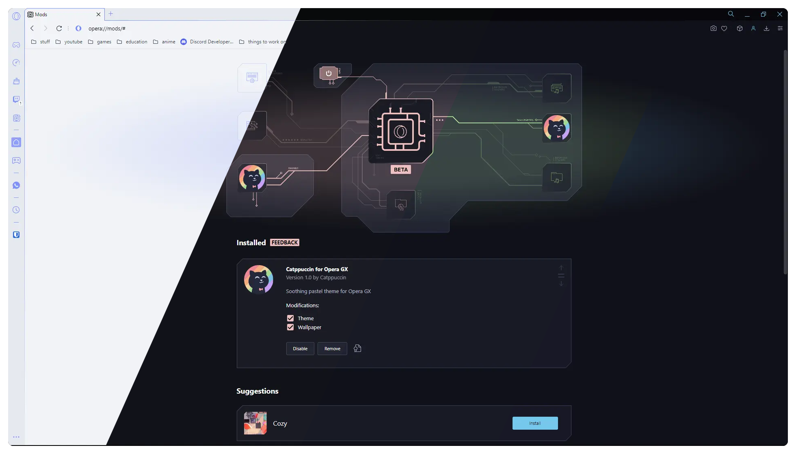
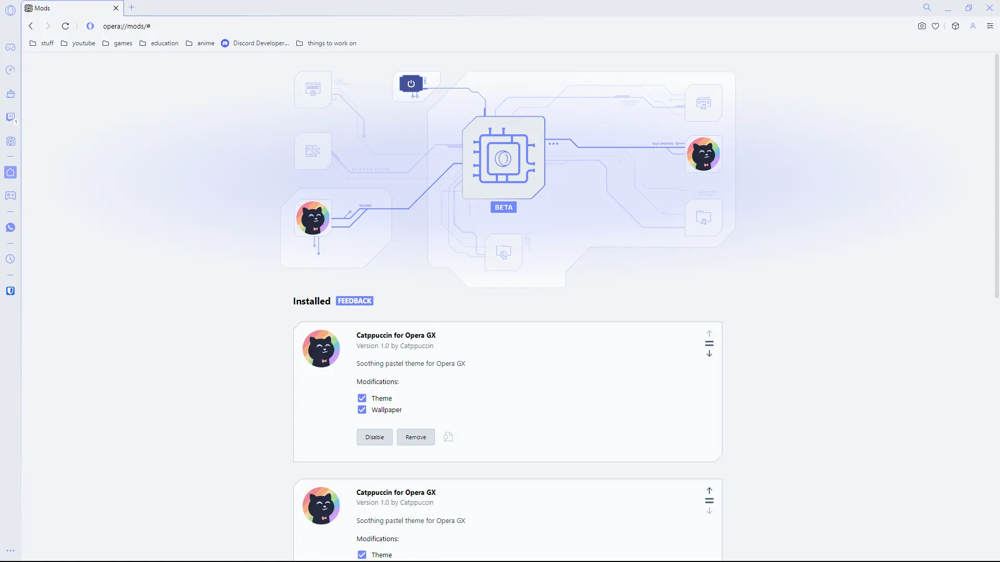
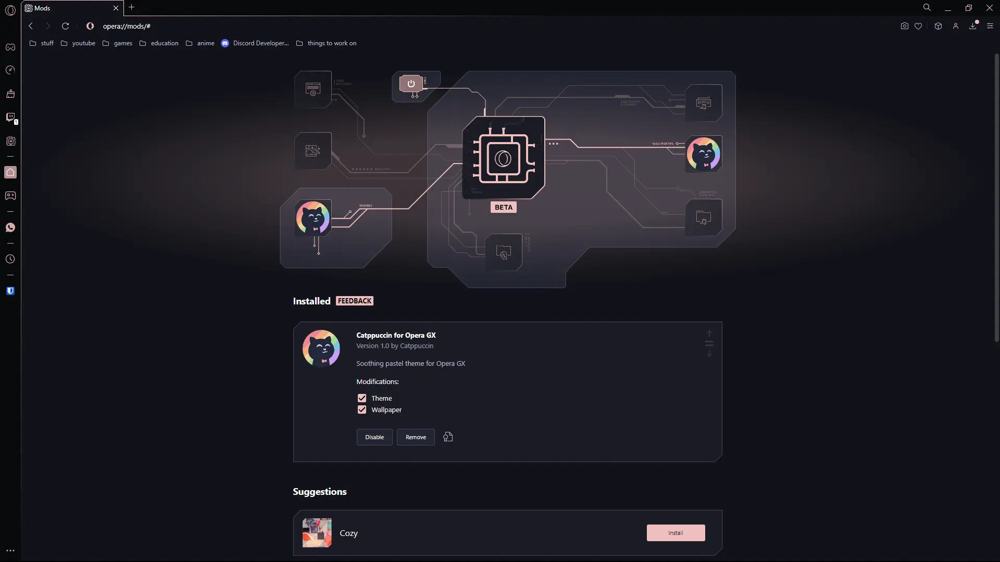
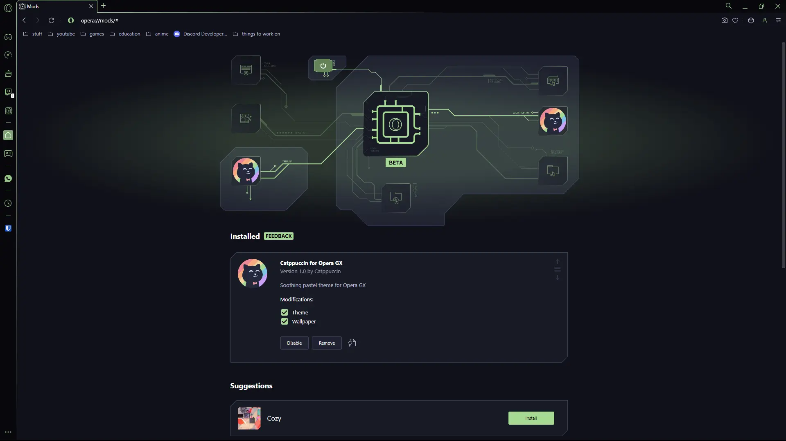
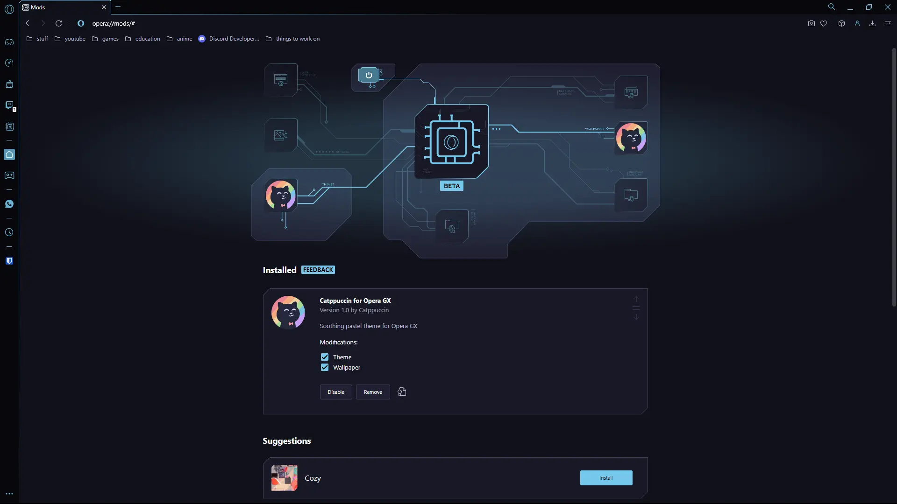

<h3 align="center">
	 
	
	Catppuccin for <a href="https://www.opera.com/gx">Opera GX</a>
	
</h3>

	
	
	

	

## Previews

🌻 Latte

🪴 Frappé

🌺 Macchiato

🌿 Mocha

## Usage

1. Download your preferred flavor and accent combination from [`themes/`](./themes/).
2. Unzip the downloaded asset from Step 1.
3. Go to the `opera://extensions` page in Opera.
4. Enable Developer Mode (if not already enabled) by flipping the toggle switch labeled **Developer mode**.
5. Click the **Load unpacked** button and select the unzipped directory from Step 2.

## 🙋 FAQ

- Q: _Where is latte?_
  A: "Latte is provided as the light mode variant of each dark flavor."

- Q: _Can I still use custom wallpapers?_
  A: "Yes, you can do this from the quick settings by enabling custom wallpapers."

## 💝 Thanks to

- [Isabel Roses](https://github.com/isabelroses)

&nbsp;

	

	Copyright &copy; 2021-present <a href="https://github.com/catppuccin" target="_blank">Catppuccin Org</a>

	

